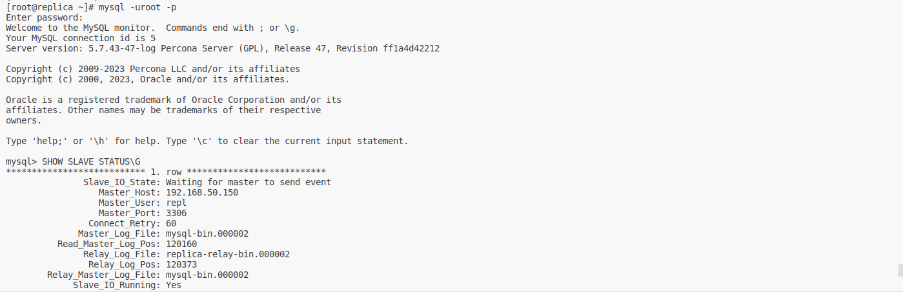
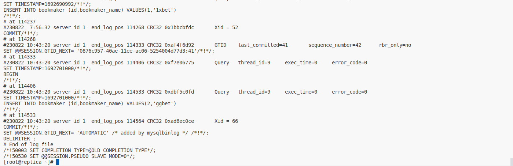

# Mysql
Для выполнения этого действия требуется установить приложением git:
`git clone https://github.com/altyn-kenzhebaev/mysql-hw27.git`
В текущей директории появится папка с именем репозитория. В данном случае mysql-hw27. Ознакомимся с содержимым:
```
cd mysql-hw27
ls -l
conf.d
bet.dmp
README.md
Vagrantfile
```
Здесь:
- screens - папка со скриншотами для рукуводства
- bet.dmp - дамп тестовой БД
- conf.d - папка с конфигами mysql
- README.md - файл с данным руководством
- Vagrantfile - файл описывающий виртуальную инфраструктуру для `Vagrant`
Запускаем ВМ:
```
vagrant up
```
Требуется скачать дистрибьютив:
```
wget https://downloads.percona.com/downloads/Percona-Server-5.7/Percona-Server-5.7.43-47/binary/redhat/7/x86_64/Percona-Server-5.7.43-47-rff1a4d42212-el7-x86_64-bundle.tar
```
## Source (Master) mysql-server 
Устанавливаем пакеты, настраиваем и запускаем сервис:
```
tar -xf /vagrant/Percona-Server-5.7.43-47-rff1a4d42212-el7-x86_64-bundle.tar 
yum localinstall /root/{Percona-Server-server-57-5.7.43-47.1.el7.x86_64.rpm,Percona-Server-shared-57-5.7.43-47.1.el7.x86_64.rpm,Percona-Server-shared-compat-57-5.7.43-47.1.el7.x86_64.rpm,Percona-Server-client-57-5.7.43-47.1.el7.x86_64.rpm}
cp /vagrant/conf.d/* /etc/my.cnf.d/
systemctl start mysql
```
Логинимся mysql root и сбрасываем пароль:
```
cat /var/log/mysqld.log | grep 'root@localhost:' | awk '{print $11}'
mysql -uroot -p
mysql> ALTER USER USER() IDENTIFIED BY 'YourStrongPassword';
```
Создаем тестовую БД и наполняем её:
```
mysql> CREATE DATABASE bet;
mysql -uroot -p -D bet < /vagrant/bet.dmp
```
Далее создаем пользователя для репликации:
```
mysql> CREATE USER 'repl'@'%' IDENTIFIED BY '!OtusLinux2018';
mysql> GRANT REPLICATION SLAVE ON *.* TO 'repl'@'%' IDENTIFIED BY '!OtusLinux2018';
```
##  Replica (slave) mysql-server
Также устанавливаем пакеты, настраиваем и запускаем сервис:
```
tar -xf /vagrant/Percona-Server-5.7.43-47-rff1a4d42212-el7-x86_64-bundle.tar 
yum localinstall /root/{Percona-Server-server-57-5.7.43-47.1.el7.x86_64.rpm,Percona-Server-shared-57-5.7.43-47.1.el7.x86_64.rpm,Percona-Server-shared-compat-57-5.7.43-47.1.el7.x86_64.rpm,Percona-Server-client-57-5.7.43-47.1.el7.x86_64.rpm}
cp /vagrant/conf.d/* /etc/my.cnf.d/
vi /etc/my.cnf.d/01-base.cnf
server-id = 2
vi /etc/my.cnf.d/05-binlog.cnf
replicate-ignore-table=bet.events_on_demand
replicate-ignore-table=bet.v_same_event
systemctl start mysql
```
Также логинимся на mysql root и сбрасываем пароль:
```
cat /var/log/mysqld.log | grep 'root@localhost:' | awk '{print $11}'
mysql -uroot -p
mysql> ALTER USER USER() IDENTIFIED BY 'YourStrongPassword';
```
Настраиваем и запускаем репликацию:
```
CHANGE MASTER TO MASTER_HOST = "192.168.50.150", MASTER_PORT = 3306, MASTER_USER = "repl", MASTER_PASSWORD = "!OtusLinux2018", MASTER_AUTO_POSITION = 1;
start slave;
```
## Проверка работоспособности

